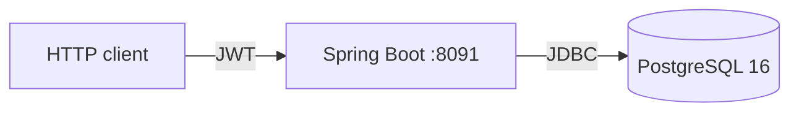

# wallet-ledger

A digital wallet built on a **double-entry ledger** — deposits, withdrawals and transfers that stay
correct when 150 threads race for the same balance.

The point of this repository is not the feature list. It is the part most CRUD projects never
exercise: **transactions, pessimistic locking, idempotency, and invariants the database itself
enforces.**

> **Status: backend complete through Phase 1B.** No frontend yet, and never deployed. See
> [What is not done](#what-is-not-done) — that section is deliberately honest.

---

## The invariant this project is built around

Money is never "moved" by updating two numbers. Every operation writes a **balanced pair of ledger
entries**, and the database refuses to commit if they do not sum to zero.

```
deposit 50 to Alice
   ledger_entry  (account 1 = SYSTEM_FUNDING,  amount −50.0000)
   ledger_entry  (account 7 = Alice's wallet,  amount +50.0000)
                                               ─────────────────
                                   SUM(amount) =        0.0000   ← enforced at COMMIT
```

`SELECT SUM(amount) FROM ledger_entry` returns exactly `0` across the entire database, at all
times. If it ever does not, money was created or destroyed — and a deferred constraint trigger
makes that impossible rather than merely unlikely.

## Three guarantees, all in the database

Application code can have bugs. These hold regardless:

| Guarantee | Mechanism |
|---|---|
| A user wallet can never go negative | `CHECK` constraint `ck_wallet_non_negative` |
| The ledger is append-only | Trigger rejecting `UPDATE` and `DELETE` on `ledger_entry` |
| Every transaction balances | `CONSTRAINT TRIGGER ... DEFERRABLE INITIALLY DEFERRED`, checked at `COMMIT` |

The third one has to be deferred: a per-row check would reject the first entry of every pair,
before its counterpart exists.

## Concurrency

Money moves through exactly one method, `LedgerPostingService.post`. It runs at **READ COMMITTED**
and does not depend on the isolation level for correctness — it depends on holding a row lock for
the whole read-modify-write:

- Both accounts are locked with `SELECT ... FOR UPDATE`, in **ascending account id order**.
- The two locks are **two separate statements**. A single `WHERE id IN (a, b) ORDER BY id FOR
  UPDATE` would not do: PostgreSQL makes no promise about the order in which it acquires row locks
  within one statement, so only sequential locking makes the ordering a real guarantee.
- Hibernate emits `FOR NO KEY UPDATE`, not `FOR UPDATE`. That is correct and deliberate — the
  reasoning is in [`docs/hoc/NHAT_KY_BUG.md`](docs/hoc/NHAT_KY_BUG.md) entry 7.

Two tests prove it rather than assert it:

| Test | What it demonstrates | Measured |
|---|---|---|
| `ConcurrentWithdrawalIT` | 150 threads withdraw 1 from a wallet holding 100 → exactly 100 succeed, 50 refused, balance lands on exactly `0.0000` | 11.97 s |
| `TransferDeadlockIT` | 50 threads transfer A→B while 50 transfer B→A → no `40P01`, no lost money | 13.02 s |

A lost update would leave the balance *above* zero. The `CHECK` constraint would catch it going
below. Both directions are asserted.

## Idempotency

The `Idempotency-Key` header is mandatory on every money-writing endpoint, so a double click or a
timeout retry cannot charge twice.

The key lives in **PostgreSQL, not Redis** — because the key and the ledger entries have to commit
atomically. Two stores have no shared commit, so a failure between them either double-charges the
customer or loses the request.

The orchestration is split in two, and the reason is subtle: a unique-constraint violation
**aborts the PostgreSQL transaction**, so the losing writer cannot read the winner's row from
inside it.

| Class | Transactional? | Job |
|---|---|---|
| `IdempotencyService` | No | Look first, interpret what it finds, decide the answer |
| `IdempotentExecutor` | Yes | Claim the key and run the operation, together or not at all |

| Situation | Answer |
|---|---|
| Same key, same request, already finished | Replay the stored response |
| Same key, different body **or different endpoint** | `422` |
| Same key, concurrent, winner not yet committed | `409` — never a guessed response |
| Operation failed | The claim rolls back; the key is free again |

## Audit that survives a rollback

`AuditLogger` is its own bean using `REQUIRES_NEW`, so a **refused** operation still leaves a trail
after the caller rolls back — the only case where an audit log earns its keep. Calling a
`REQUIRES_NEW` method on `this` would bypass the Spring proxy and silently join the caller's
transaction, so the separate bean is load-bearing, not style.

Success is recorded on `afterCommit` instead, so the log describes outcomes rather than intentions.

---

## Architecture



```
auth/          registration, login, JWT, rotating refresh tokens with reuse detection
account/       wallet entity and read model
ledger/        LedgerPostingService — the only place a balance changes
money/         deposit, withdrawal, transfer; the three HTTP endpoints
idempotency/   claimed-key row, replay, conflict handling
audit/         REQUIRES_NEW logger
security/      JWT filter, RFC 7807 entry point
```

`LedgerPostingService` is the chokepoint. Any future feature that moves money and does not go
through it is a design error, not a shortcut — and it validates its own input rather than trusting
that everything arrives through the HTTP layer.

## Tech stack

| Layer | Choices |
|---|---|
| Backend | Java 21, Spring Boot 3.5.16, Spring MVC, Spring Data JPA, Spring Security, JJWT 0.13, Flyway, Maven |
| Database | PostgreSQL 16 — `NUMERIC(19,4)`, no floating point anywhere near money |
| Testing | JUnit 5, Testcontainers 1.21.4, MockMvc, AssertJ, Mockito |
| Errors | RFC 7807 `ProblemDetail` on every path, including validation and auth |

## API

| Method | Path | Notes |
|---|---|---|
| `POST` | `/api/v1/auth/register` | |
| `POST` | `/api/v1/auth/login` | Access token 15 min + rotating refresh token |
| `POST` | `/api/v1/auth/refresh` | Reuse of an old token revokes the whole family |
| `GET` | `/api/v1/wallet` | Takes no identifier — the account comes from the token |
| `POST` | `/api/v1/wallet/deposits` | Requires `Idempotency-Key` |
| `POST` | `/api/v1/wallet/withdrawals` | Requires `Idempotency-Key` |
| `POST` | `/api/v1/transfers` | Requires `Idempotency-Key` |

Amounts are validated with `@Digits(integer = 15, fraction = 4)`, mirroring `NUMERIC(19,4)`
exactly: a finer amount is **refused, never silently rounded**. `@DecimalMin("0.0001")` stops a
negative withdrawal from becoming a disguised deposit.

Amounts are serialised as JSON **strings**. JSON numbers are read as IEEE-754 doubles by many
clients — JavaScript's `Number` among them — and a `NUMERIC(19,4)` carries more significant digits
than a double holds exactly.

## Tests

**80 tests, 0 skipped**, every one an integration test against a real PostgreSQL container.

```bash
docker run --rm -v "$PWD/backend:/app" -v "wallet-m2:/root/.m2" \
  -v "/var/run/docker.sock:/var/run/docker.sock" \
  -e TESTCONTAINERS_HOST_OVERRIDE=host.docker.internal \
  -e TESTCONTAINERS_RYUK_DISABLED=true \
  --add-host host.docker.internal:host-gateway -w /app \
  maven:3.9-eclipse-temurin-21 mvn -B verify
```

No JDK or Maven needed on the host — only Docker.

## What is not done

Stated plainly, because a README that hides gaps is worth less than one that does not:

- **No frontend.** API only.
- **Never run outside tests.** Every test builds its database with Testcontainers and throws it
  away. `docker compose up` has not been run once, so the application has not started against a
  long-lived database yet.
- **Never deployed.** No CI, no server.
- **No coverage number.** JaCoCo is not configured; ArchUnit is a dependency with no rules written.
- **No statement, no refund, no Kafka.** Phase 2.
- Idempotency keys and audit rows are never pruned — no TTL, no cleanup job.

## Learning documentation

[`docs/hoc/`](docs/hoc/) — written in Vietnamese, explaining the design decisions and the eleven
real bugs hit while building this, including how each was diagnosed.

[`docs/superpowers/`](docs/superpowers/) — the design spec and the phase plans this was built from.
